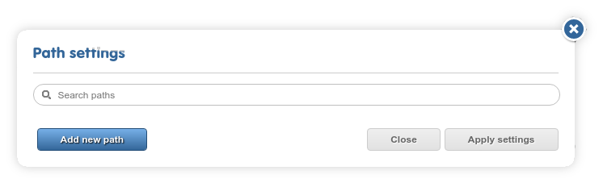
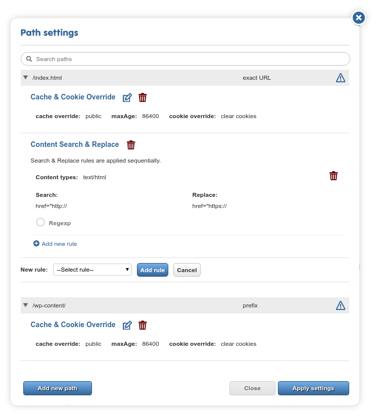
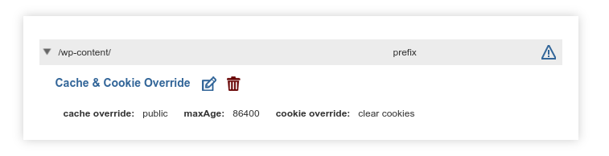
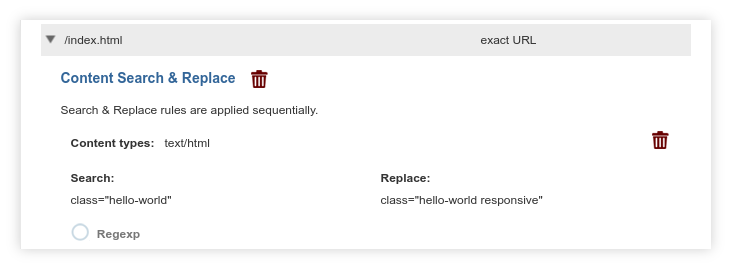
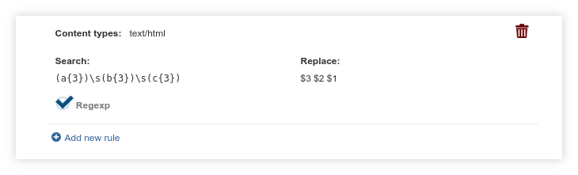

## Path settings

The proxy supports the declaration and use of rules called path overrides (alternatively called subtree overrides). They can be used to apply a variety of changes to an exact (e.g. `/about-us.html`) or prefix paths (e.g. all pages under `/products`). 

A project has no overrides by default. Besides the search field at the top, the "Add new path" button is available. Click on it to type or copy & paste your path/prefix. Click on the "Add path" button to the right of the row to add it to the list. The option to choose the type  of the path (exact URL or prefix) is available as a dropdown.

You'll notice that adding new paths and setting up corresponding overrides are done at two separate stages. Any path can have more than one type of override associated with it (but overrides differ in how many of each can be present on a given path).

There is a row of icons to the right of each path that you can use to edit the overrides. Click on the blue plus icon to add a new override for a path. Each type will also have another set of icons for editing and deletion.

Keep in mind:

- overrides are applied only on **intra-domain** paths (elsewhere called the project URL). They cannot be applied on any path referenced on an external domain.

- overrides are applied early on in the pipeline, before any translated text is inserted. They are also **not** target-language specific.

- query parameters (`?q=value` etc.) are **not** supported. Do not add them to path overrides.

- When declaring a content type, mak sure you use an *exact* description: `text/html` does not equal `text/html; charset=utf-8` or vice-versa. Be specific.

- Some of the overrides (particularly search & replace overrides) become non-editable after they are saved. You'll need to delete and re-add these rules to change them.

**Important!** *Add/edit multiple paths and overrides at once, but remember that all changes are **UNSAVED** until you click on "Apply settings"!* Keep an eye out for the ⚠ icons on the right, as shown in the screenshot below.

### Cache & Cookie Overrides

This override allows you to declare the `Cache-Control` and `max-age` headers for a prefix or URL and optionally clear the cookies. 

The path seen in the screenshot above is a typical use case: it ensures that resources on the `/wp-content` prefix, associated with WordPress sites, can be cached for 24 hours.

Setting ` cache-control: public, max-age=86400` on a URL/prefix in this way broadcasts to the network that the resource(s) there can be publicly cached. Depending on the location of the caching node and the pathway of the request, the content will be served from caches instead of going through the proxy pipeline. 

This is beneficial for both speed and cost reasons. What is otherwise tolerable server load on the original site might be unnecessary page view cost overhead over the proxy (with speed overhead not being much of a concern). We provide this capability as a useful cost optimization strategy. 

**Important!** Do NOT add overly general paths or too large `max-age` values without considering the effects! Please read through [our description of the issue](/dashboard/cookbook/stagingdomain.html) before using the feature.

**Only one** cache & cookie override may be present on each path or prefix.

### Search & Replace Override

Run a search & replace on the page or pages on the prefix. This lets you apply simple changes to the page source. You can choose between string or regexp replacement.

In the example above, search & replace is used to extend the list of classes for any element that possesses only the *hello-world* class.

The replacement field supports regexp backreferences via the `$n` format, as in the screenshot above. The example looks for "**aaa bbb ccc**" in the page source, stores backreferences to each letter group and reverses their order, resulting in the output "**ccc bbb aaa**".

Refer to the [`java.util.regex.Pattern` documentation](https://docs.oracle.com/javase/7/docs/api/java/util/regex/Pattern.html) for the details of the supported regular expression format. 

Note that search & replace is a "naive" operation both for strings and regexps: HTML is not parsed, nor JavaScript evaluated at this stage (roughly, S&R runs as if it were working on a plain text source file). It cannot be used to solve recursive tasks.

**Multiple** S&R overrides can be added on the same prefix, and they will be applied *sequentially*. No two replacement strings/regexps may match, the dialog will display an error if you attempt to enter the same replacement rule twice.

### Default Charset Override

This override is presented as a simple text field, the contents of which will be used for `<meta charset="...">` tags. Useful in cases where the original site is declared to be in an encoding that is incompatible with one of the target languages.

**Only one** charset override may be present on each path or prefix.

### Content-Type Override

Override the Content-Type HTTP header for a given path or prefix. Frequently used with template URLs or JS resources with mischaracterized Content-Types, it is sometimes useful to avoid encoding or character escaping troubles.

**Multiple** `Content-Type` overrides can be added on each path or prefix, but no two such fields may match.
