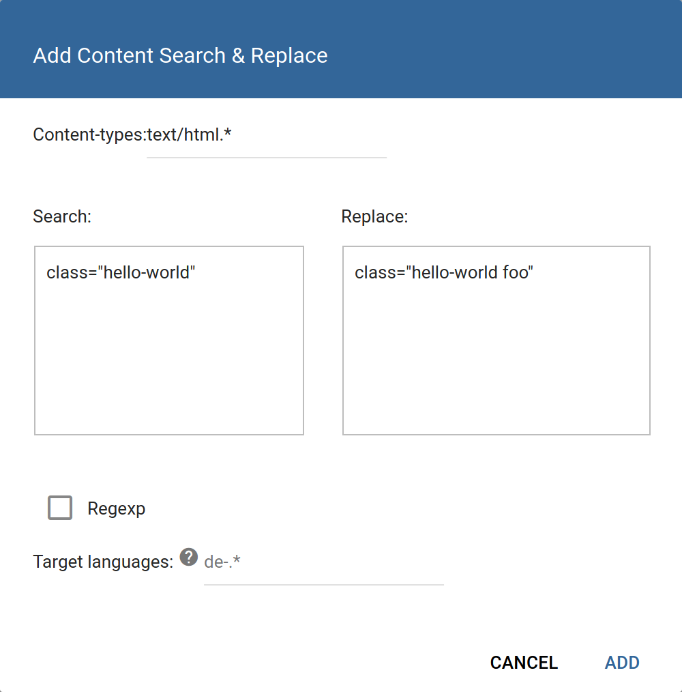
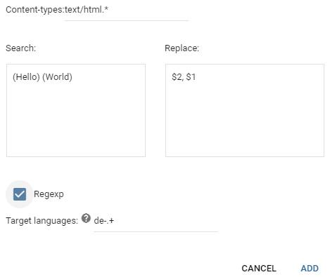

# Search and Replace

## Overview

Run a search & replace on the page or pages on the prefix. This lets you apply simple changes to the page source. You can choose between string or regexp replacement.

In the example above, search & replace is used to extend the list of classes (with a new class `foo`) for any element that possesses only the *hello-world* class.

The replacement field supports regexp backreferences via the `$n` format, as in the screenshot above. The example looks for "**Hello World**" in the page source, stores backreferences to each letter group and reverses their order, resulting in the output "**World hello**".

Refer to the [`java.util.regex.Pattern` documentation](https://docs.oracle.com/javase/8/docs/api/java/util/regex/Pattern.html) for the details of the supported regular expression format. 

Note that search & replace is a "naive" operation both for strings and regular expressions: HTML is not parsed, nor JavaScript evaluated at this stage (roughly, S&R runs as if it were working on a plain text source file). It cannot be used to solve recursive tasks.

**Multiple** S&R overrides can be added on the same prefix, and they will be applied *sequentially*. No two replacement strings/regexps may match, the dialog will display an error if you attempt to enter the same replacement rule twice.

## Parameters

+ _Content-types_: a pattern determining what content types the rule will apply to
+ _Search_ and _Replace_: patterns that determine replacements. If _Regexp_ is selected below, capture groups and backreferences may be used.
+ _Regexp_: treat the above patterns as regular expressions, enabling the use of cepture groups and other features.
+ _Target languages_: a pattern that determines which locales the rule will apply to. These patterns are applied to the locale codes (such as `de-DE`) and are case-sensitive! Omit to have the pattern apply to all locales.
