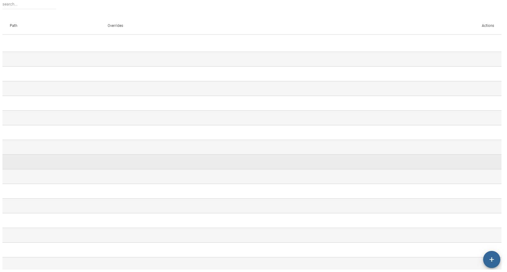
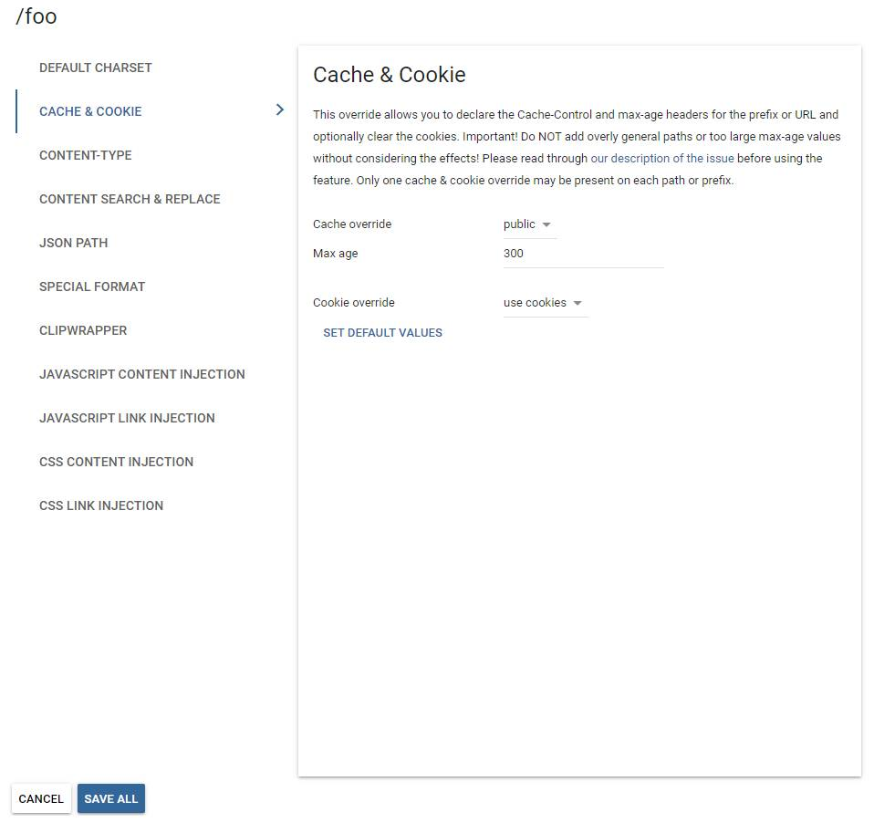

## Path settings

The proxy supports the declaration and use of rules called path overrides (alternatively called _Subtree Overrides_). They can be used to apply a variety of changes to an exact (e.g. `/about-us.html`) or prefix paths (e.g. all pages under `/products`). 

A project has no overrides by default. Besides the search field at the top, the "Add new path" button is available. Click on it to type or copy & paste your path/prefix. Click on the "Add path" button to the right of the row to add it to the list. The option to choose the type  of the path (exact URL or prefix) is available as a dropdown.

You'll notice that adding new paths and setting up corresponding overrides are done at two separate stages. Any path can have more than one type of override associated with it (but overrides differ in how many of each can be present on a given path).

There is a row of icons to the right of each path that you can use to edit the overrides. Click on the blue plus icon to add a new override for a path. Each type will also have another set of icons for editing and deletion.

Keep in mind:

- overrides are applied only on **intra-domain** paths (elsewhere called the project URL). They cannot be applied on any path referenced on an external domain.

- overrides are applied early on in the pipeline, before any translated text is inserted. They are also **not** target-language specific.

- query parameters (`?q=value` etc.) are **not** supported. Do not add them to path overrides.

- When declaring a content type, make sure you use an *exact* description: `text/html` does not equal `text/html; charset=utf-8` or vice-versa. Be specific.

**Important!** *Add/edit multiple paths and overrides at once, but remember that all changes are **UNSAVED** until you click on "Save All"!*

