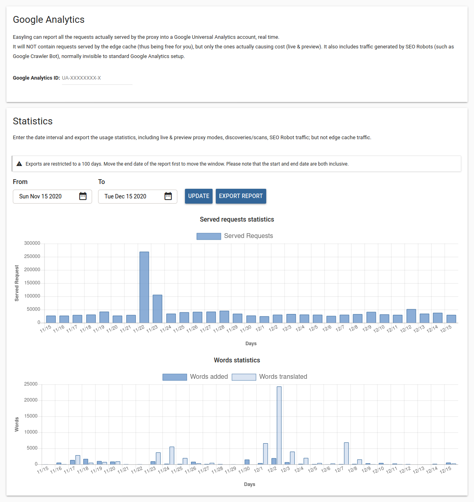

# Project statistics

This screen shows you the most important statistics of the project as well as allowing you to add Google Analytics to it.

## Google Analytics

In this section, you can enter a Google Analytics Universal Tracking ID. When you do, the proxy will start reporting the requests it receives to Google Analytics. These are the requests that the proxy processes and thus are billed to you. 

## Statistics

This section gives you an overview of the main statistics that generate cost to you. Served requests are the same as those reported to Google Analytics if you have a code set up. Word statistics show you the amount of content you add and add translations for on a daily basis. You can select a date range of up to 100 days for these charts and for the exports. The export is created in the cloud and is emailed to you. It is an Excel spreadsheet containing the same information. This allows you to process it in external tools.
