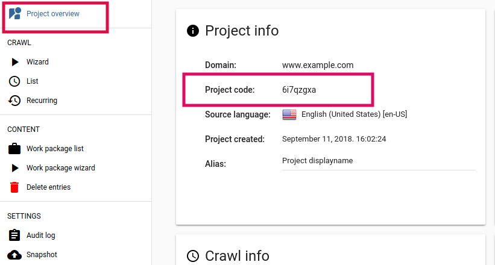

# Contacting Support

Website translation can be a complex task, even with the help of a piece of software like Easyling. Finding the root of the problem can be equally complex for us on support duty. Therefore, we would like to give you a few pointers on what the supply when you're contacting us.

This first thing we need is the **project code**. This is an eight-character unique string that uniquely identifies the project in our system. Following the screenshot below, you can find the project code in the address bar of your browser - you can copy the entire URL for us, but only the code will suffice as well.

We also need a **thorough description of the problem**. A full screenshots of the problem will help tremendously, especially if it's to do with the layout of a translated site. If it's to do with the translations themselves, please give an example segment, along with the page it's found on, as well as the source text. If the problem has to do with an XLIFF import, please include the file you imported, along with at least one example segment with its page (the more, the better, though).

With the information you've given us, we can start uncovering the root cause of the problem you're running into, and someone from the support team will respond shortly with a solution, a request for more information, or simply an update.
