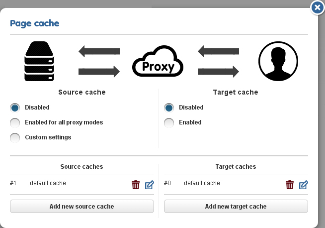
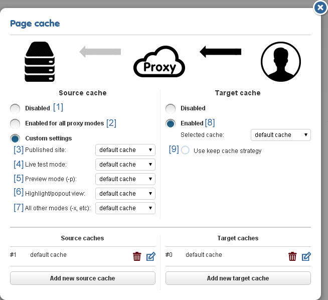
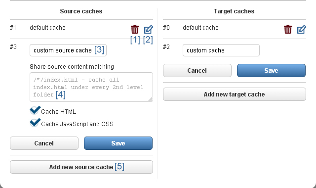
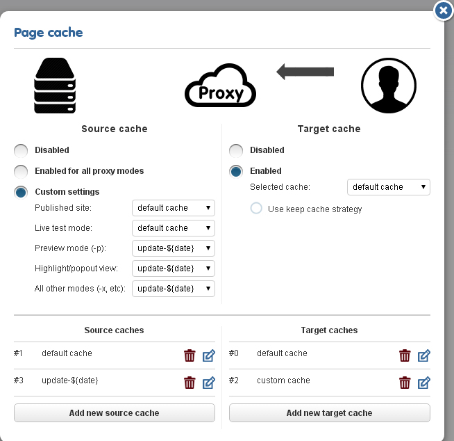
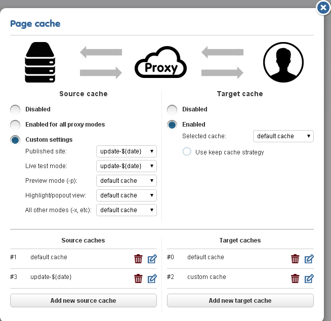

# The Multi-Cache

On December 22, the public beta of the multicache feature has drawn to a close, and the final user interface was rolled out, giving users the power to add, rename, and assign separate caches to various proxy modes.

## Recap
Easyling has had its caching capabilities for well over a year now. Initially, the proxy only cached the output of the translation process, in order to speed up serving the translated pages if the source remained unchanged - this was called the Binary Cache. Later on, this was expanded with the option to serve the Binary Cache even if the source content was changed - we called this the Keep Cache. Finally, the Source Cache was added not long after, enabling the project owners to store the remote server responses, effectively freezing the site in the state it was at the time of the crawl. By using a careful combination of the three caches and adjusting content ingestion cycles to content update cycles, it became possible to heavily limit or even eliminate bleedthrough entirely (though even if the source cache was on, non-cached content could still be accessed!).

## The Problem
Initially, the caches were single-version entities, with the same cache being overwritten as new content came in. The caches could be cleared, but not restored, opening up the translated site to bleedthrough. Additionally, if the content ingestion became desynchronized from the content update, word counts were skewed and possibly the wrong content was ingested for translation.
## The Way Forward
By enabling the users to create multiple caches both for source and target, it became easier to retain one cache for freezing the site in its last fully-translated state, while another holds content from the latest round of ingestion, currently being translated; while the separate target cache entities enable you keep the complete translations to be served, regardless of the changes being done in translation until the client signs off on them. Additionally, it is now possible to assign different cache entities to different proxy modes - this enables you to start work (including ICR!) on the newly-ingested content, while keeping the live serving site available without changes.
## The Interface
The old Page Cache dialog has been scrapped in the last update, and replaced by a completely different interface, expanded to fit the requirements of the enhanced page caching feature. Similarly, the Scan limit dialog has been given a dropdown so that you can select which cache the data written into.

    

By default, all caches will be off, with only the defaults existing.

In order to take advantage of the Translation Proxy caches, you'll need to activate at least one of the options.    

1. Disable the cache
1. Use the same selected cache entity for all proxy modes
1. Content being served on the validate serving domain (e.g.: http://jp.example.com)
1. Live proxy mode (no special behavior)
1. Preview (-p, bypasses the Target cache and Manual Publishing,  always displays the latest translations)
1. Highlight mode on the Workbench, to be used for In-Context Reviewing
 Collection of miscellaneous special proxy modes (-x used for demonstration purposes, -d for debugging purposes, others may be implemented in the future)
1. Enable the Target cache with the selected cache entity, for faster serving of unchanged pages (bypasses the translation engine if the source content is the same as the content used to generate the cache entity). The Target Cache is only used for the published site, and will not be used nor built in the other modes!
1. Enable the Keep Cache Serving Strategy: keep serving the cached content even if the source changes. This behavior can be used to limit bleedthrough, but the cache must be cleared manually to display the new translations.

New cache entities can be added at any time. Currently, the Proxy supports a maximum of five of each type, over the two default caches. For the Target Cache, the entities automatically span all target languages on the project at any time (that is to say, any changes to the target language list will be automatically reflected in the cache, though newly added target languages will naturally not have cached content ready yet).

1. Clear cache: purge the content of the selected cache. BEWARE: if this entity is being used to serve the published site, doing so may cause immediate bleedthrough! In case of accidental purge, we can help you by recovering the cache contents, if, and only if, you have not overwritten the entity by re-building the cache yet.
1. Edit cache: allows you to edit the entity settings (name only for Target entities, path restrictions as well for Source entities)
1. Display name for the currently selected cache. Will be shown in the above dropdowns for easier reference.
1. Path restriction settings: wildcard-compatible path specifications can be used to restrict the cache to be used only on certain sections of the site.
- Create a new named cache entity, up to a maximum of five (over the default)

## Case Studies
### \#1: Freezing the site before translation commences
In this example, the client has declined to use a staging server, as well as declining to halt content updates for the duration of the initial translation. They do, however, insist that bleedthrough must not occur at any point in the translation process. This results in a continuously changing source that makes it nearly impossible to achieve 100% translation.

In this case, the solution is to enable the Source cache, and populate it with a Scan before the first round of translation commences. This creates what is effectively a static snapshot of the site, which remains the same regardless of the updates the client makes in the meantime, providing a stable environment for the translation and review processes.

By using a Source cache to serve the translated sites, they are decoupled from the original, and content updates there will not be reflected in the translations.

However, source content will accumulate in the meantime, and once the cache is purged, bleedthrough will occur! To counter this, the second scenario can be enacted.

### \#2: Decoupling content update from ingestion and publishing
For this example, the client has declined to use a staging server to allow you to ingest the content ahead of publishing for translation. They did, however, agree to notify you once new content is published, and have acknowledged that this will cause the translated sites to lag behind the original until the translations (and possibly reviews) are completed.
Alternatively, coupling into the previous scenario, the initial translations are in place, but the source site has moved ahead in the meantime, with the translated site being served by the initial Source cache.

Once the initial translations are completed, the caches are set up according to the image below:

By driving the published site from a separate cache entity, you gain the ability to decouple the content ingestion cycle from the translation and update cycles.

From this point on, the published site will not reflect any updates until the assigned entity is refreshed. By specifying the update cache in the Scan Limit dialog, you write the server responses into the newly created cache, which will drive the Preview and Highlight modes, allowing you to conduct the translations and ICR using the new content. Once the client signs off on the translations, you simply switch the Source cache entities being used (and purge the Target cache, if in use).

<caption id="attachment_2645" align="aligncenter" width="654"> Once translations and reviews are completed, simply re-assign the cache entities to promote the new content to the translated "Production"</caption>

At this point, the previously-live cache entity is freed up for purging and re-building in the next update cycle. Thus, at the next crawl, the default would be selected to receive the updates, leaving the other entity untouched.

By managing which entity is being used to serve the published site and which one is being written to, it becomes possible to replicate the behavior of the staging server, albeit at the cost of increased attention to detail.

Any questions that arise should be directed to support@easyling.com. That way, our team can give you a tailored response and assist with your projects.
