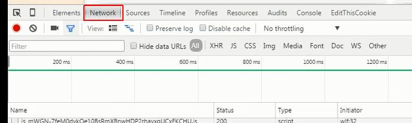
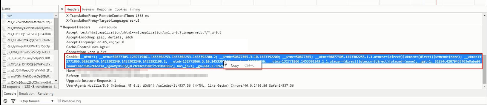

# Content behind secure login

To scan content behind secure login, please follow this procedure:  
  
1.) Open your project and navigate to the **Content** menu. 
2.) Open the **Pages** list.  

3.a) Visit the page with the login, if it is listed, and click **Preview**. 
**OR** 
3.b1) Go to the **Preview** of the front page (the "/", the first one on the Pages list). It will give you the front page through the proxy. 
3.b2) Go to the address bar and type in the URL of the login-protected page. 
  
  

4.) Enter your login details. 
5.) Open your browser's DevTools from the Menu (F12 on Windows). 
6.) Go to** Network** and reload the page. 
  
   
  
7.) Scroll up to the first item and click on it. 
8.) Under headers scroll to the cookie header (among request headers), and copy the entire header. 
  
   
  
9.) Pass it to the Proxy: go back to your project and click on **Content**. Paste the entire content in the **Scanning cookies** field. 

  
10.) Click on **Scan manually** and specify the required scanning settings. You will receive an e-mail notification once scanning is ready and new content is available for translation.
