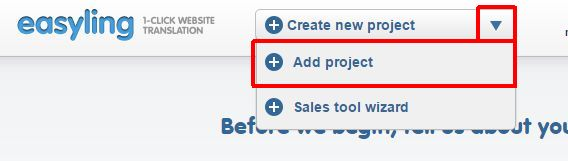

# Giving a Quote

## Project creation:

You can create a new project with the **Add Project** dialog, using the dropdown menu on the Dashboard's top toolbar.  

  

This opens the **Add project** dialog box, where you can enter the URL of the website you would like to translate, and also select the website language; this sets the source language of the translation project.  

**Add project dialog:**

  

The **Start discovering automatically** option is selected by default. ***Discovery*** is the preliminary assessment of the website, without storing the website content. This process starts from the URL you specified, scans all the pages, follows all links, and returns the URL list of the visited pages, together with the wordcount and repetition rates. As Discovery costs 1EUR per thousand pages, you may want to disable automatic discovery. You can run discovery manually at any later time. You can disable automatic discovery by removing the check mark.  
You can also select **Process pages in source language only** to restrict translatable pages; this feature is particularly useful for websites where content in different languages is mixed, without clear language distinction in the URL. Before using this option for the first time, you have to set up the Google Translate API by clicking on the link there. Please note that Google Translate API is available only as a paid service, and you need your own account.  

You can also use **Advanced options** to refine discovery. These include:  
- **Check if the domain redirects to another domain** - when creating the project, Easyling will first check for redirections. By disabling this option, you can force the creation of the project tot he domain you specify, regardless of its existence or redirection settings. However, the root page (`/`) will not be added by default!  
- **Include pages only starting with** - here you can limit discovery to a specific set of pages, like company  or contact information, services, products, etc. You can remove or add pages at any later stage, and you can remove this restriction as well.  
- **Ignore these paths** - here you can exclude pages that you don't want to be assessed, like blog, forum and news entries. These are typical examples of pages where an enormous amount of irrelevant or outdated information can accumulate as years pass. Any page excluded here, upon project creation, can later be included in the project, if needed.   
- **Provide custom SRX file** - easyling uses its own language-specific segmentation rules, but you also have the option to use your preferred rules, by uploading your own [.SRX file](https://en.wikipedia.org/wiki/Segmentation_Rules_eXchange). Please note that segmentation rules can't be modified once the project is created.  

#### Advanced options in the Add Project dialog

##### Exclusion and inclusions rules on project creation:

These are the settings you specify under **Include pages only starting with** and **Ignore these paths**. You can input page inclusions and exclusions when you already have a concept before running a Discovery - e.g. a potential client asked for a quote by specifying the pages to be translated (or to be left out from translation).  
If you don't have a preliminary idea, or the initial discovery indicated a much higher volume than expected, this refining can be done later using the rules editor under Discovery / Pages or Content / Pages.

##### Provide custom SRX file:

Working with custom SRX files might be necessary in certain cases, like special requirements from clients, but more commonly for migration purposes.  
Some clients might require the use of custom segmentation rules to optimize website content segmentation to their existing translation memories. It is not uncommon that business owners already have product catalogs and other business-related materials translated before they decide to have their website translated as well - and it is a sound business idea to re-use existing resources to the most possible extent. To meet this requirement you can use the client's own segmentation rules for your projects.  
It is not uncommon either that clients switch from one platform or service provider to another, and wish to migrate all their existing data - including their website content. This, again, might require the use of custom segmentation rules, so that existing resources could be re-used.  
As segmentation rules can't be modified once the project is created, please make sure to check if your client has any special segmentation requirements.

**Screenshot of the dialog:**

## Discovery:  

You can run Discovery of the site automatically when you create the project, or at any later time manually from the Dashboard.

  

During the first discovery you can specify a discovery page limit, but you can also run unlimited discovery. By default this limit is set to 100, because it would give you a good overview of the website, and also a comfortable protection should anything go wrong with the website. Unlimited discovery is not recommended, unless you have a very thorough information on the site.

  

Once the discivery is ready, you receive an e-mail notification, and the statistics will show up on the Discovery page. Based on this you can give a rough estimation for the website translation cost - both in time and money.  

  

#### Statistics, fuzzy matches:

For the time being, a thorough explanation of Easyling's statistics can be found here:
* [http://lesson101.tutorial.easyling.com/](http://lesson101.tutorial.easyling.com/)

#### 102% matches:

A 102% match is a special type of ICE-match, an entire block-level element (say, a paragraph), where every single segment (sentence) is 101% match (the segments match down to the tags, AND the segment immediately before and after are also such matches).
There's a reason to this - auto-propagation. With auto-propagation, Easyling is able to provide 102% matches for free as only one entry is created in the datastore.

#### Unlimited Discovery:

It is only advised to start an unlimited Discovery when you have thorough information on the structure of the site. Examination of the site in question before running a Discovery or a Scan is considered best practice.
Starting a discovery with a page limit of a 1000 will give you security while still providing a good picture of the site's layout. In case something goes wrong, you'll still have a very good idea about what's going on and with that information, you can re-configure the project accordingly.

**Screenshot of the Discovery panel set to a page limit of 100:**

#### Using a sitemap for Discovery:

One of the best ways to discover a website is to use a sitemap.
If the website in question has a sitemap.xml, you can input that when starting a Discovery.
This can be beneficial as search engines also use the sitemap (when available), so they don't have to crawl the whole website.
We've seen examples when pages behind a login were only hidden with the use of CSS, so the crawler easily discovered content that was out of the desired scope. Using a sitemap.xml is a good way to go in such situations.

Learn more about sitemaps on the standard's website:
* [http://www.sitemaps.org/](http://www.sitemaps.org/)

#### Using a URL list when running Discovery:

If you happen to have a URL list provided by the client, you can also run a limited crawl using that list. In this case, the crawler will only visit the URLs on the list. To do this, you'll use the Add Pages dialog from the Discovery view, and paste either full URLs, or only paths (Easyling will expand paths in the context of the project domain).  
Make sure you open the dialog from Discovery at this point - using it from Scan will conduct a content extraction crawl, which has a higher cost!

#### Password/login (basic auth, cURL/cookies)

There are two functions in Easyling that can handle logins on websites, and enable you to Discover and Scan them.

##### Basic Authentication:

The first solution deals with Basic Authentication:

If the website in question has basic authentication implemented, you can input the credentials on the Discovery page, and carry on with the process. It should work out of the box.

Read more about Basic Authentication:
* [https://en.wikipedia.org/wiki/Basic_access_authentication](https://en.wikipedia.org/wiki/Basic_access_authentication)

**An example Basic Authentication dialog:**

##### Cookie extraction

The second method is to extract a cookie header and pass it to the proxy after logging in on the website in question through the preview proxy:

The preview proxy is accessible from the Pages list, by clicking the button on the toolbar which appears by hovering over the desired page(s).

We cannot guarantee that the cookie extraction method works with all proprietary logins, as there are several solutions which can use additional security measures such as IP checking, or checking the User-Agent header. As all the requests from the proxy and the crawler come from the Google Cloud, it is necessary for the target site to not block them.

* Google Chrome DevTools guide: [https://developer.chrome.com/devtools](https://developer.chrome.com/devtools)

#### E-commerce websites and regular expressions:

On e-commerce websites, it is explicitly not advised to start an unlimited Discovery. In most cases, these websites and their product directories can get the crawler into an infinite loop due to filtering in paths or query parameters in the URL.

E-commerce websites can give you an extremely high word count, due to the vast amount of pages. These pages usually have a lot of repetitions. You can use regular expressions to achieve even more 102% matches in segments containing denominations, units, etc.

See our tutorial on pattern matching:
* [http://lesson103.tutorial.easyling.com/](http://lesson103.tutorial.easyling.com/)

A crash course in regular expressions on Learn Regex The Hard Way:
* [http://regex.learncodethehardway.org/book/](http://regex.learncodethehardway.org/book/)

##### Group pages, ignore query parameters:

The following three features can help tackle challenges by grouping up pages or ignoring them, most notably on e-commerce websites.

They can be helpful, when for some reason the site in question uses query parameters in a manner that the same content gets served under different URLs.
An example for this we've seen is when a `?refresh=x` parameter (where `x` is a number) is appended to the end of the URL every time when visiting the page.

These settings are not retroactive. Rules and query parameter inputs should be made before doing a Discovery. Rules and settings made after a discovery won't have an effect on the already existing pages list.
Deleting entries from the pages list is not possible for users at this time.

* Group pages at Advanced Settings:

Handle pages as one if the URL of the pages matches any of the rules specified below. New pages will be translated, but will not be appearing in the Pages list. This is particularly useful when translating certain types of webshops, where the same (or very similar) content is served on many different URLs.
Example: to group pages like this (/_el/frontend/project/g3r3b1ye/advanced-settings) together, use `/_el/frontend/project/*/advanced-settings`. The rules need to start with "`/`". The "`*`" character is wildcard.

Example: `/category/*/ordered/`

* Group pages by ignoring query parameters:

Matching source segments are merged across pages in the group.

Query parameters are part of the URL, they may or may not induce changes. For every changed query parameter we create a new page record. After verifying that parameter changes don't induce changing of content, you can just use query parameters so we don't catch every single page where only the parameter changes in the URL.

* Ignore query parameters:

Listed query parameters will be ignored.

NOTE: you should input only the query parameter(s) in question when using `group pages by ignoring query parameters` or `ignore query parameters`. Entering a full URL won't have any effect. You only need to input the name of the query string.
A query string follows the `?name=value` format.

An example:

Full URL: `https://www.yourdomain.com/something.php?fruit=1`
Query string: `?fruit=1`
Name of query string: `fruit`

Read more about URLs and their structure here:
* [https://en.wikipedia.org/wiki/Uniform_resource_locator](https://en.wikipedia.org/wiki/Uniform_resource_locator)

Read more about query parameters (query strings) here:
* [https://en.wikipedia.org/wiki/Query_string](https://en.wikipedia.org/wiki/Query_string)

Read more in our tutorial from ignores to page freezes:
* [http://lesson102.tutorial.easyling.com/](http://lesson102.tutorial.easyling.com/)

##### Payment gateways

One way to deal with prices within an e-commerce project in Easyling is to create indicatory prices by translating a single currency, and exchanging prices.

As actual payment gateways feature heavy security, and communication occurs between the backend and the payment gateway which is hidden from the proxy, Easyling is not able to capture this content and translate it.
Most website owners don't want to be PCI compliant and have their own payment solution implemented. But in this rare case, Easyling works out-of-the-box, while also retaining full compliance (Easyling is PCI-compliant, while AppEngine has [annual audits](https://cloud.google.com/security/compliance) for several standards including PCI and SOC).

#### Proxy modes - X, P, live

##### X-proxy (testing, JS bugs, JS fix domains , CORS)

The X-proxy is great for testing. You can spot content that does not get picked up by default, and make your configurations to your project, and check for success.

There are a couple of situations, when the X-proxy comes in handy:
* Testing regular expressions, for example on e-commerce sites.
* Testing JSON (JavaScript) and XML translation.
* Just browsing through a site, for evaluation purposes.

An example X-proxy URL: https://de-de-{project_code}-x.app.easyling.com

The X-proxy can be accessed from the pages list under Content (or Discovery) by clicking on the Preview button in the hover toolbar, while holding down the Ctrl/Cmd button, or you can just replace the -p for a -x in the normal preview's URL for the same effect.

##### Preview-proxy (p)

The standard proxy mode to view the translated website before publishing. However, the preview can be used for a couple of other things:

* Cookie header extraction to get behind logins
* Visiting pages manually, to ingest content

An example Preview-proxy URL: https://de-de-{project_code}-p.app.easyling.com

##### Live serving mode

After publishing the website, the proxy serves content on the chosen domain.

#### CORS

Cross-origin resource sharing will likely take place if the site draws content (fonts, generally, but also images or scripts) from elsewhere, or if certain requests are hardwired to use the original domain. In these cases, the affected resources must carry the `Access-Control-Allow-Origin` header, with its value being set to the project's serving domain.

Read more about CORS:

* [https://en.wikipedia.org/wiki/Cross-origin_resource_sharing](https://en.wikipedia.org/wiki/Cross-origin_resource_sharing)

#### JSON path / XPath translation
##### JSON Path translation:

This feature's text-field in Advanced settings contains the capture group definitions used to extract attribute-value pairs from JavaScript files selected for translation/localization.
After entering the capture parameters and re-crawling the site, Easyling will display the selected JavaScript files as translatable pages in the pagelist, from where they can be selected for translation in the List View like regular pages, and any values for the selected attributes will be made available as translatable entries, which are treated identical to regular entries. Entering “` html`” (N. B. The switch is separated by a space!) after the path specification will result in Easyling applying its HTML parser to the match instead of a plaintext parser, stripping out HTML markup and only offering the actual content for translation (otherwise, should the match contain markup, the translator must take care not to alter it, or risk breaking the translated site).

Our JSON path tester tool can help you locate and validate the paths in question.

More about JSONpath:
* [http://goessner.net/articles/JsonPath/](http://goessner.net/articles/JsonPath/)

##### XPath translation:

Easyling is able to translate XML (eXtensible Markup Language) files sent by the remote server, according to the XPath standard of specifying elements of the XML structure. Similar to JavaScript translation, entering the “` html`” switch will result in the HTML parser being applied, while no switch will parse the match as plaintext.

More about XPath:
* [https://en.wikipedia.org/wiki/XPath/](https://en.wikipedia.org/wiki/XPath/)

#### Exclusions: path, page, class, ID, translate="no"
##### HTML 5 translate="no" attribute

To exclude content from translation, you can use the HTML 5 standard translate="no" attribute. This attribute explicitly tells translation tools to ignore the elements
Easyling will ignore these.

Definition and Usage:  [http://www.w3schools.com/tags/att_global_translate.asp](http://www.w3schools.com/tags/att_global_translate.asp) 
A blog post which explains why it's needed:  [http://rishida.net/blog/?p=831](http://rishida.net/blog/?p=831)

#### Path Exclusions

By default, Easyling crawls every single URL in the target domain. For certain sites, this can mean tens of thousands of individual pages if the crawler is not restricted by page number. To avoid premature depletion of quotas, a path restriction system was implemented, allowing users to limit the crawler to certain paths on the site.
If the site’s structure is known in advance, it is possible to specify these path prefixes before Discovery is initiated. If the structure is unknown, a restricted Discovery scan will create a rudimentary map of the site’s structure, providing a basis for manipulating the URL lists.
Restriction rules may have three forms:
* Inclusion rules:
the crawler is restricted to the specified path prefix, and everything outside that is ignored (excluded)
* Exclusion rules:
everything with the given prefix is ignored, but everything else is included in the scan?
* Manual exclusion (“cherry-picking”): only the selected page is excluded from content extraction

These rules can be used in any combination, and without limit. The only illegal rule is
including the root directory (“/”), which is equivalent to no rules being specified, therefore this is not permitted, and Easyling will not save such an inclusion rule.
The path prefixes can be entered after opening the Rules editor. Prefixes must be entered starting with the domain’s root (“/”), and should ideally end on a / as well. Also note that the rules you enter are prefixes only, any path beginning with the strings you set will match them, and setting post-fixes (rules matching the end of the path) are not possible.

It is also possible to force a set of pages into Easyling’s scope, by using the appropriate function in the page list. Depending on the list is called from, the resulting dialog will either only discover the URLs pasted, or it will extract content right away and process it for translation.
The same dialog can be used to crawl only the publicly accessible parts of the site by giving Easyling the link to the site’s sitemap.xml1 file. Once the link is entered, Easyling will parse the XML, and crawl the site accordingly, making sure that only the publicly accessible pages are crawled and extracted.

##### Ignore classes

If identified and deemed translation invariant, you can use ignore classes to ignore content with classes. Please be advised, that this only works for content that is available in the page's source code - Easyling cannot deal with content put there by javascript.

**Screenshot:**

#### Dynamic content (forms), Marketo/Hubstpot (linked projects)

Please see this step-by-step tutorial on setting up sites with external forms: [http://lesson105.tutorial.easyling.com/](http://lesson105.tutorial.easyling.com/)

#### Forums, e-commerce (importance-based translation)

##### Forums

Let's take product forums as an example, it is a common situation that in some language someone already posted a possible solution, which is not available in other languages.
Machine translation and automatic pre-translation can be used to tackle these mixed language sitations.

On-site search function:

1. The search function usually won't work out of the box, as the original search engine does not have any information about the translations.
2. The easy solution is to machine translate the search query, and use that for search.
3. Another possible solution, and a better one is to integrate the custom search engine feature by Google. It will crawl the translated content. Pricing and more information is available on Google's site: [https://developers.google.com/custom-search/](https://developers.google.com/custom-search/)
4. Google site search can also be used. It gives the standard Google search engine results and it's free but ad supported.
