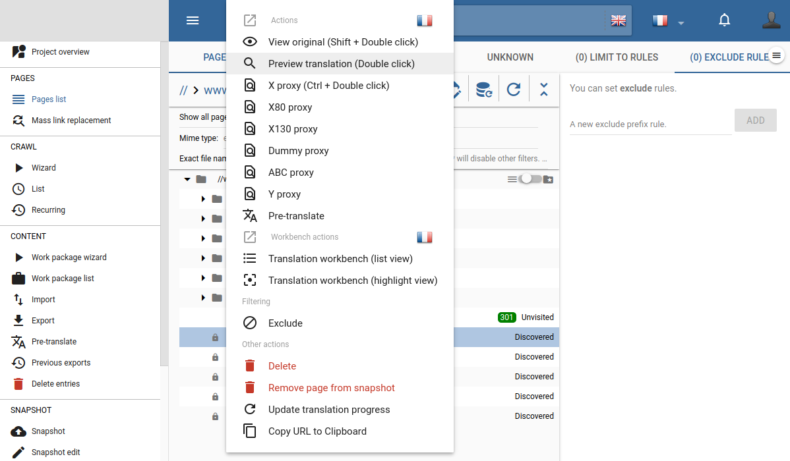
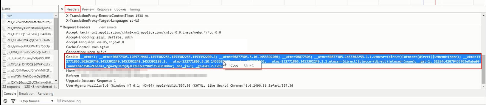
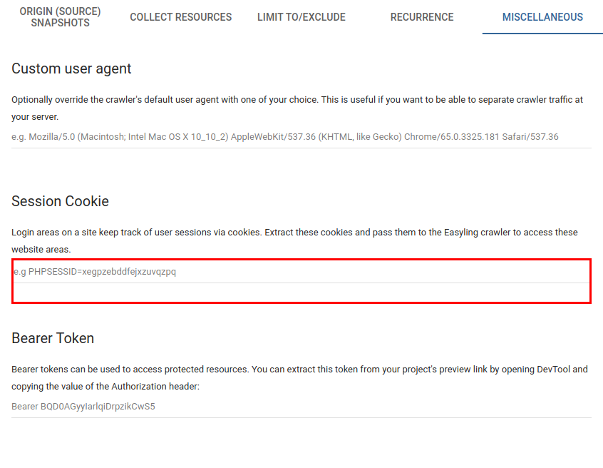

# Scanning Content Behind Secure Login

To scan content behind secure login, please follow this procedure:

1. Open your project and navigate to the **Content** menu. 

2. Open the **Pages** list.

3. Visit the page with the login, if it is listed, and click **Preview**.
   
    **OR** 
   
   Go to the **Preview** of the front page (the "/", the first one on the Pages list). It will give you the front page through the proxy.
   
    **OR** 
   
   Go to the address bar and type in the URL of the login-protected page.

4. Enter your login details.

5. Open your browser's DevTools from the Menu (F12 on Windows).

6. Go to** Network** and reload the page.

7. Scroll up to the first item and click on it.

8. Under headers scroll to the cookie header (among request headers), and copy the entire header.

9. Pass it to the Proxy during your next crawl: when you get to step 4 of the Crawl wizard, go to the *Miscellaneous* tab. Paste the cookie value into the Session Cookie field and run your crawl as usual.

